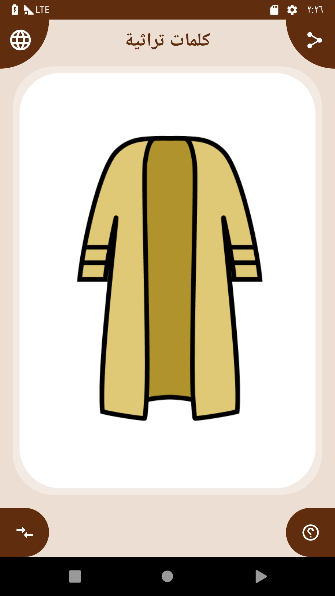
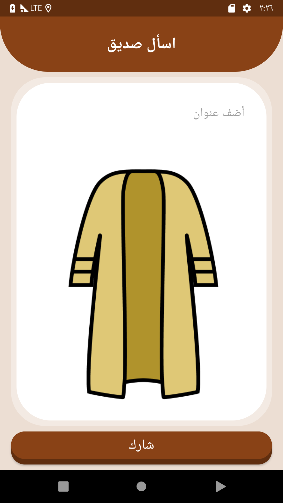
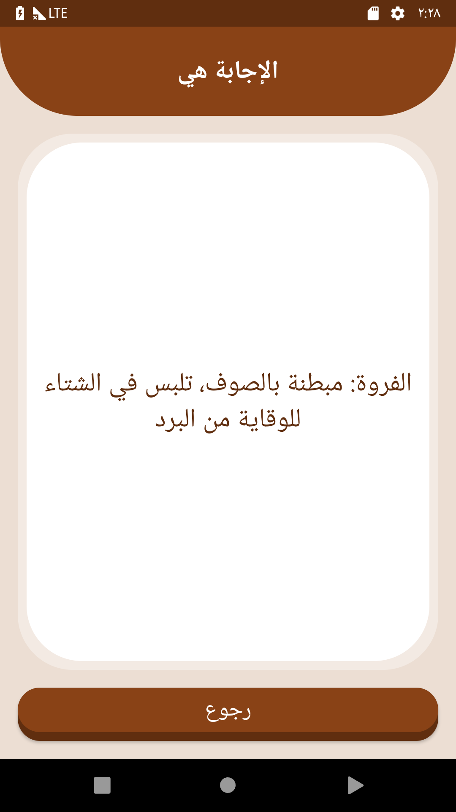

# 
نبذة عن المشروع

في هذا المشروع ستقوم بتطوير لعبة مشابهة للعبة "خمن" التي قمنا بتطويرها خلال الدروس السابقة. لكن هذه المرة لن يكون هنالك أسئلة نصية.

اللعبة ستكون حول الكلمات التراثية و يمكن لعبها من قبل شخصين في آن واحد كالتالي:

<ol>
<li>
يقوم الشخص الأول بعرض صورة لشيء من التراث على اللعبة.
</li>
<li>
على الشخص الثاني أن يخمن معنى الصورة.
</li>
<li>
بعد إعطاء الإجابة، يمكن للشخص الأول التأكد منها بالنقر على زر "عرض الإجابة" أسفل اللعبة لعرض الإجابة الصحيحة.
</li>
</ol>

# 
الهدف من هذا المشروع ؟
 

الهدف من هذا المشروع هو تطبيق كل ما درسته خلال الدروس السابقة في تطبيق واحد مثل خاصية دعم اللغات، التعامل مع مكونات الـ UI و الـ Intents و بناء تطبيقات متعددة الشاشات.

# 
متطلبات المشروع

يجب أن يحتوي المشروع على المزايا التالية:
<ul>
<li>
واجهة أولى تعرض الصورة التراثية في منتصف الشاشة بالاضافة إلى أربعة أزرار:
<ul>
<li>
زر لعرض الإجابة الخاصة بالصورة.
</li>
<li>
زر لتغيير الصورة.
</li>
<li>
زر لمشاركة الصورة.
</li>
<li>
زر لفتح قائمة لتغيير لغة التطبيق بشكل يدوي. يجب أن تدعم اللعبة لغتين على الأقل مثلا: العربية و الإنجليزية.
</li>
</ul>
</li>
<li>
واجهة ثانية خاصة بمشاركة الصورة تحتوي على عنصر إدخال النصوص لكتابة عنوان المشاركة.
</li>
<li>
واجهة ثالثه خاصة بعرض الإجابة الصحيحة.
</li>
</ul>

# 
الشاشة الرئيسية

  

# 
شاشة المشاركة

  

# 
شاشة الإجابة

  

